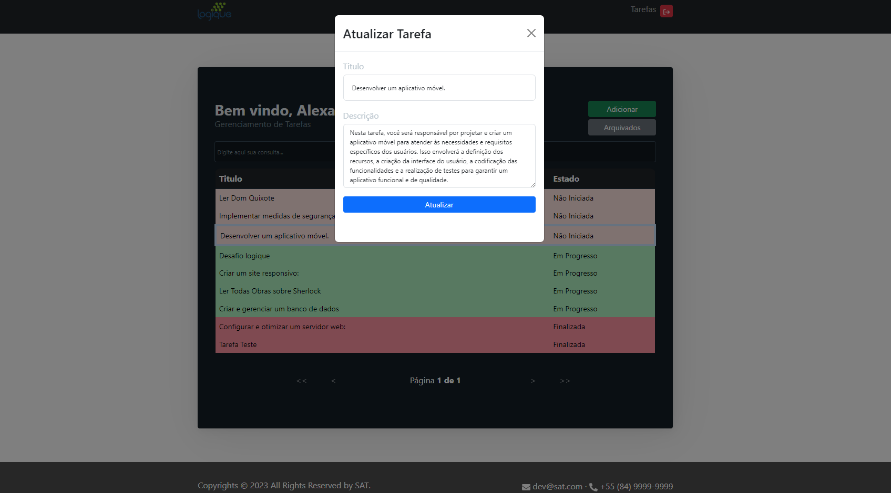

# Sistema de Gerenciamento de Tarefas

Este é um aplicativo de sistema de gerenciamento de tarefas desenvolvido com Spring Boot e Next.js.

## Pré-requisitos

Certifique-se de ter as seguintes ferramentas instaladas em seu sistema:

- Java Development Kit (JDK) versão 8 ou superior

- Node.js e npm (Node Package Manager)

- Clone o repositório:

```bash
git clone https://github.com/Alhexx/application-taferas.git
```

## Configuração do Backend (Spring Boot)

### Comandos para a execução:

1. Execute o Docker compose para ter um container do postgres já configurado para a aplicação:

```bash
docker compose up -d
```

2. Navegue até a pasta do Backend

```bash
cd .\backend\
```

3. apos isso execute o seguinte comando:

```bash
mvn spring-boot:run
```

### Apos a inicialização do serviço:

- Abra no seu browser [http://localhost:8083/api/swagger-ui/index.html#/](http://localhost:8083/api/swagger-ui/index.html#/) para ter acesso a documentação e usabilidade das rotas existentes no backend.

## Configuração do FrontEnd (Next.js)

### Comandos para a execução:

1. Instale o Yarn

```bash
npm install --global yarn
```

2. Instale as depencias

```bash
yarn install
```

3. Execute a aplicação

```bash
yarn dev
```

### Apos a inicialização da aplicação

- Abra no seu browser [http://localhost:3000](http://localhost:3000) para ter acesso a aplicação.

## Uso da Aplicação

### Tela inicial da aplicação

- nela o usuário tem tanto a opção de login quanto de se registrar no sistema.
  

### Tela de registro de usuários na aplicação

- nela o usuário preenche com nome, email, senha, confirmação da senha e clica no botão <kbd>Registrar-se</kbd>. Qualquer erro ou sucesso que venha ocorrer é mostrado ao usuário através de toasts
  

### Tela de login de usuários na aplicação

- nela o usuário preenche com email, senha e clica no botão <kbd>Entrar</kbd>. Qualquer erro que venha ocorrer é mostrado ao usuário através de toasts
  

### Tela de Gerenciamento de Tarefas

- para visualizar essa tela o usuario tem que estar efetivamente logado, caso contrário ele não consiguirá acessar-la.
  

  - Nesta tela, digitando no input de consulta o usuário consegue filtrar as informações que ele preferir.
    

  - Nesta tela, clicando no botão de <kbd>Adicionar</kbd> é aberto um modal para cadastramento de novas tarefas. Todas tarefas recem criadas tem o estado como "Não iniciada".
    

  - Nesta tela, clicando no botão de <kbd>Arquivados</kbd> é aberto um modal que te dá acesso a uma lista de tarefas que foram arquivadas. Nessa lista o usuário pode selecionar qualquer tarefa e desarquivar ela ou excluí-la.
    

  - Nessa tela, selecionando uma atividade, o usuário pode com um clique no botão direito ter acesso as funcionalidades de <kbd>Mudar Status</kbd>, <kbd>Editar Tarefa</kbd>, <kbd>Arquivar</kbd> e <kbd>Excluir</kbd>.

    - Clicando em <kbd>Arquivar</kbd> o Estado da tarefa é imediatamente alterado para Arquivado e a tarefa é retirada da lista
      

    - Clicando em <kbd>Mudar Status</kbd> é aberto um modal que possibilita a mudança de estado. Tenha em mente que a mudança de estado tem regras... mas caso alguma seja desrespeitada o usuário recebe um toast explicativo
      

    - Clicando em <kbd>Editar Tarefa</kbd> é aberto um modal que possibilita a edição tanto de titulo quanto de descrição. Tenha em mente que a edição de tarefas tem regras... mas caso alguma seja desrespeitada o usuário recebe um toast explicativo
      

    - Clicando em <kbd>Excluir</kbd> a tarefa é imediatamente excluida. Tenha em mente que a exclusão tem regras... mas caso alguma seja desrespeitada o usuário recebe um toast explicativo
      
